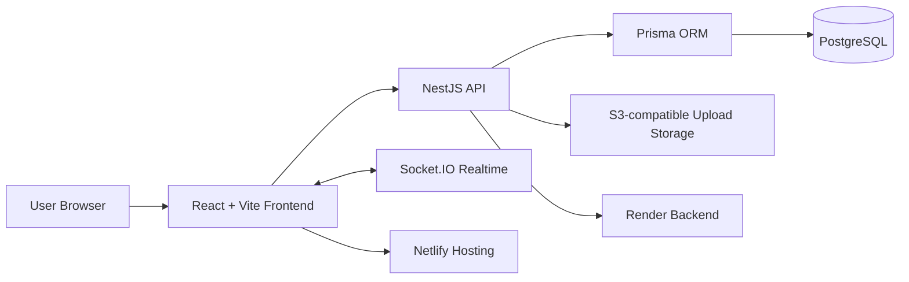

<div align="center">

  

  <p>
    <strong>SYNC · CORE · AURA</strong>
  </p>

  <p>
    <a href="https://zynqora.netlify.app/login"></a>
    <a href="https://github.com/sachinchaudhary451543/Zynqora.app"></a>
    
    
  </p>

  <p>
    
    
    
    
    
  </p>

</div>

---

## ✨ Overview

**Zynqora** is a futuristic social media platform designed around meaningful circles, real-time sync, and a premium neon-first user experience.

It brings together profile discovery, posts, stories, chat, reactions, comments, aura-style identity, and community-focused interactions inside a polished full-stack TypeScript application.

> **Tagline:** Your People. Your Circle. Your Zynqora.

---

## 🌐 Live Experience

- 🚀 **Live App:** [https://zynqora.netlify.app/login](https://zynqora.netlify.app/login)
- 🧭 **Signup:** [https://zynqora.netlify.app/signup](https://zynqora.netlify.app/signup)
- 💻 **Repository:** [github.com/sachinchaudhary451543/Zynqora.app](https://github.com/sachinchaudhary451543/Zynqora.app)

---

## 🖼️ Product Preview

<div align="center">

| Landing / Login Concept | Product Feel |
| --- | --- |
| `ZYNQORA · SYNC · CORE · AURA` | Neon social dashboard |
| `Your People. Your Circle. Your Zynqora.` | Real-time circles and aura-driven identity |
| `Create Your Circle` | Community-first onboarding |

</div>

---

## 🔥 Premium Features

<table>
  <tr>
    <td width="50%">
      <h3>🌊 Sync Stream</h3>
      <p>A modern social feed built for posts, reactions, comments, media previews, and real-time interaction flow.</p>
    </td>
    <td width="50%">
      <h3>⭕ Circles Hub</h3>
      <p>Community-first social graph experience for following, mutual connections, and circle-style relationship building.</p>
    </td>
  </tr>
  <tr>
    <td width="50%">
      <h3>⚡ Direct Sync</h3>
      <p>Real-time chat foundation powered by Socket.IO and authenticated backend events.</p>
    </td>
    <td width="50%">
      <h3>💫 Aura System</h3>
      <p>Profile-first identity layer with user presence, aura cards, suggestions, and modern social discovery.</p>
    </td>
  </tr>
  <tr>
    <td width="50%">
      <h3>📸 Stories & Media</h3>
      <p>Story modules and upload architecture designed for social content sharing and richer media experiences.</p>
    </td>
    <td width="50%">
      <h3>🛡️ Privacy First</h3>
      <p>JWT authentication, password hashing, protected APIs, and environment-based configuration.</p>
    </td>
  </tr>
</table>

---

## 🧱 Tech Architecture



### Frontend

- React 18
- Vite 5
- TypeScript
- React Router
- Socket.IO client
- HLS/media-ready dependencies
- Premium custom CSS with neon dashboard styling

### Backend

- NestJS 10
- Prisma ORM
- PostgreSQL
- JWT authentication
- bcrypt password hashing
- Socket.IO gateways
- Upload module with S3-compatible architecture

---

## 📁 Repository Structure

```text
Zynqora.app/
├── backend/                 # NestJS API, Prisma schema, auth, posts, chat, uploads
│   ├── prisma/              # Database schema and Prisma configuration
│   └── src/                 # Application modules and services
├── frontend/                # React + Vite + TypeScript client
│   └── src/                 # Pages, components, API client, auth context, realtime client
├── docker-compose.yml       # Local PostgreSQL development service
├── netlify.toml             # Netlify frontend deployment config
├── render.yaml              # Render backend deployment blueprint
└── README.md                # Project documentation
```

---

## ⚙️ Local Development

### Prerequisites

- Node.js 20+
- npm
- Docker Desktop
- PostgreSQL-compatible database for production deployments

### 1. Clone the repository

```bash
git clone https://github.com/sachinchaudhary451543/Zynqora.app.git
cd Zynqora.app
```

### 2. Start PostgreSQL locally

```bash
docker compose up -d
```

### 3. Configure the backend

```bash
cd backend
cp .env.example .env
npm install
npm run prisma:push
npm run start:dev
```

Backend runs at:

```text
http://localhost:3000/api
```

### 4. Configure the frontend

```bash
cd ../frontend
cp .env.example .env
npm install
npm run dev
```

Frontend runs at:

```text
http://localhost:5173
```

---

## 🔐 Environment Variables

Use `.env.example` files as templates. Do **not** commit real `.env` files.

### Backend

| Variable | Purpose |
| --- | --- |
| `DATABASE_URL` | PostgreSQL connection string |
| `JWT_SECRET` | Strong signing secret for authentication |
| `JWT_EXPIRES_IN` | Token expiration window |
| `PORT` | API server port |
| `CORS_ORIGIN` | Allowed frontend origin in production |
| `SERVER_BASE_URL` | Public backend URL for deployed environments |

### Frontend

| Variable | Purpose |
| --- | --- |
| `VITE_API_BASE` | Base URL for the backend API |

---

## 🚀 Deployment

### Frontend: Netlify

The repository includes `netlify.toml` for the React SPA.

Recommended configuration:

- Base directory: `frontend`
- Build command: `npm run build`
- Publish directory: `frontend/dist`
- SPA fallback: enabled by `netlify.toml`
- Environment variable: `VITE_API_BASE=https://your-backend-host/api`

### Backend: Render

The repository includes `render.yaml` for backend deployment.

Recommended production settings:

- Use managed PostgreSQL/Supabase for `DATABASE_URL`
- Set a strong `JWT_SECRET`
- Set `CORS_ORIGIN=https://zynqora.netlify.app`
- Keep secrets in platform environment variables only
- Use object storage for user uploads

---

## ✅ Current Modules

- Authentication and authorization
- User profiles
- Follow and mutual-follow workflows
- Posts feed
- Likes and comments
- Stories
- Chat foundation
- Suggestions and discovery
- Upload handling
- Realtime gateway structure
- Health check endpoint

---

## 🗺️ Product Roadmap

- [ ] Rich media upload pipeline with object storage
- [ ] Production-grade realtime messaging UX
- [ ] Notifications and activity center
- [ ] Advanced circle privacy controls
- [ ] Aura profile customization
- [ ] Video/audio calling integration
- [ ] AI-assisted content and community tools
- [ ] Mobile packaging with Capacitor

---

## 🧪 Quality & Validation

Recommended checks before deployment:

```bash
cd frontend
npm run build

cd ../backend
npm run build
```

Also verify:

- API health route
- Login/signup flow
- Post creation
- Feed visibility
- Chat connection
- Upload path configuration
- Production CORS origin

---

## 🛡️ Security Notes

- Never commit `.env` files or real credentials.
- Rotate secrets if they are ever exposed in logs, screenshots, commits, or deployment dashboards.
- Use a long random `JWT_SECRET` in production.
- Restrict CORS to the deployed frontend origin.
- Store uploaded media outside the API container in production.
- Review authentication guards before exposing new APIs.

---

## 👨‍💻 Author

<div align="center">

  Built with ambition by **Sachin Kumar**

  <p>
    <a href="https://github.com/sachinchaudhary451543"></a>
    <a href="https://www.linkedin.com/in/sachin-kumar-679646218/"></a>
    <a href="https://codewithsp20079.netlify.app/"></a>
  </p>

</div>

---

<div align="center">

  <h3>Sync more. Feel more. Be more.</h3>

  

</div>
